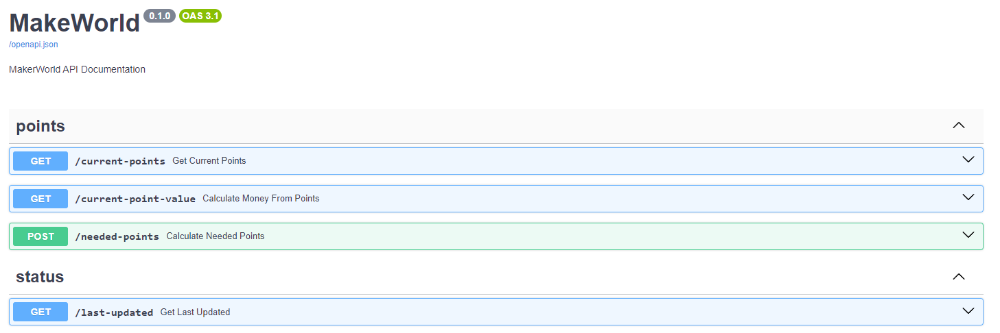

# Maker World Reward Tracker

## Project Structure

`README.MD` - This file your looking at
`.env` - shared by all the projects except the `UI` which has it's own `.env` file
`docker-compose.yml` - docker project

`backend/` - api and related files for the frontend
`data/` - shared data between containers
`frontend/` - ui
`task/` - task that syncs your points from `maker-world` to this project

## Perquisites
1. Docker and Docker Compose need to be installed [here](https://docs.docker.com/get-docker/)

## Setup
1. Rename `.env.example` to `.env` under the `root` project
   a. fill in the `account` and `password` values with your BambuLab account info
2. Rename `.env.example` to `.env` under the `frontend` project
   a. ***Note:*** `http://docker.internal` only works if you properly have an entry for it either in `/ect/hosts` (linux) -or- `C:\Windows\System32\drivers\etc\hosts`
   b. ***Note:*** If you plan on accessing this on other devices on your network you are going to need to update the `VITE_APP_POINTS_ROUTE` and `VITE_APP_UPDATED_ROUTE` with the `IP Address of the machine its going to be running on ex: 192.168.0.215`
   b. update your `TIMEZONE` to match [info here](https://en.wikipedia.org/wiki/List_of_tz_database_time_zones#List)
   c. `VITE_POINTS_NEEDED` - you can change this to anything you want to track it's set for a single `$40` gift card which is `490` points
3. Rename `data.json.example` to `data.json` under the `data` folder 
4. Rename `last-updated.json.example` to `last-updated.json` under the `data` folder
5. Update the `TZ=` to match in the `crontab` under the `task` project

## Deployment
After completing the [SETUP](#Setup) steps all you need to do is

1. Open Terminal
2. `docker compose up --build --force-recreate -d`
3. Navigate to http://localhost

## API Endpoints Documentation
After successfully [Deploying](#Deployment)

1. Navigate to http://localhost:{port-number-as-you-defined}/docs

   You should see something similar

## Technologies used

1. [Docker](https://docker.com/)
2. [Docker Compose](https://docs.docker.com/compose/)
3. [ViteJs](https://vitejs.dev/)
4. [React](https://react.dev/)
5. [Redux](https://redux.js.org/)
6. [Python](https://www.python.org/)
   a. [FastAPI](https://fastapi.tiangolo.com/)