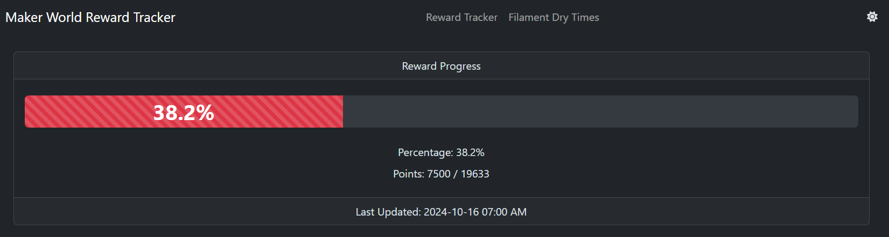
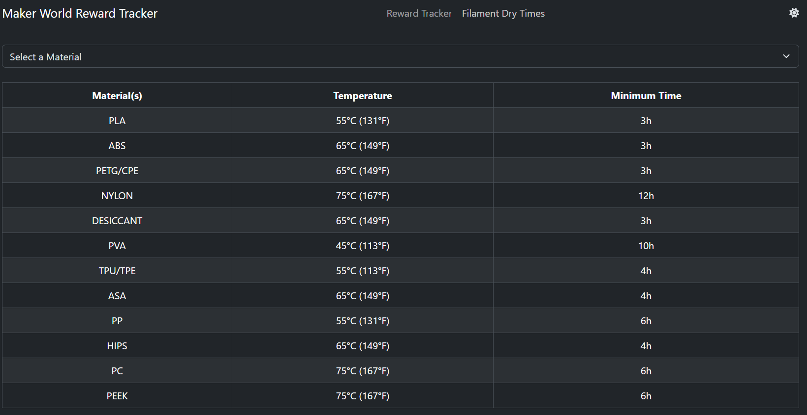
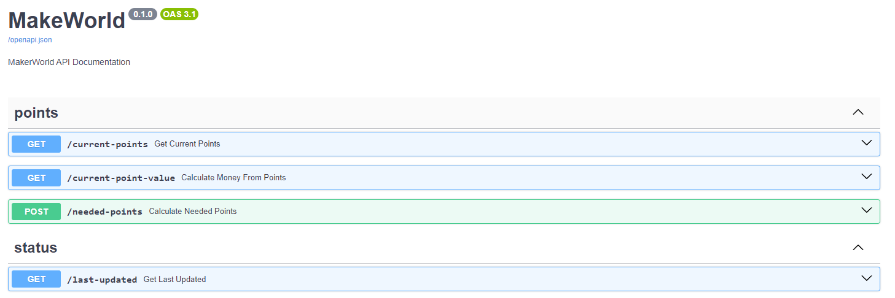

[](https://www.codefactor.io/repository/github/ondrovic/maker-world-rewards-tracker)

# IMPORTANT: 2024-11-01

As of now the automated task to retrieve points from BL api is broken, this is due to them updating to cloudflare and changing some settings, I am looking into a work around for this Ticket: https://github.com/ondrovic/maker-world-rewards-tracker/issues/9

# Maker World Reward Tracker





## Project Structure

`README.MD` - This file your looking at
`.env` - shared by all the projects except the `UI` which has it's own `.env` file
`docker-compose.yml` - docker project

`backend/` - api and related files for the frontend (now includes an SSE endpoint for real-time updates)
`data/` - shared data between containers (includes `auth.json` for authentication)
`frontend/` - ui
`task/` - task that syncs your points from `maker-world` to this project

## Real-Time UI Updates

The frontend now uses **Server-Sent Events (SSE)** for instant updates when your points or last update change.

- The backend exposes two SSE endpoints:
  - `/last-updated/stream` — streams the last update timestamp
  - `/current-points/stream` — streams the current points value in real time
- The frontend connects to these endpoints using the `VITE_APP_UPDATED_STREAM_ROUTE` and `VITE_APP_POINT_STREAM_ROUTE` environment variables in its `.env` file.
- When the backend data changes (via the scheduled task), the UI updates instantly—no more polling delays!

### Frontend .env Example

```
VITE_APP_UPDATED_STREAM_ROUTE=http://localhost:5001/last-updated/stream
VITE_APP_POINT_STREAM_ROUTE=http://localhost:5001/current-points/stream
```

## Perquisites

1. Docker and Docker Compose need to be installed [here](https://docs.docker.com/get-docker/)

## Setup

1. Rename `.env.example` to `.env` under the `root` project
   a. Update the `AUTH_FILENAME` to point to your auth.json file (default: `data/auth.json`)

   **NOTE:** auth.json is currently generated using this tool: [Bambulab Authentication CLI](https://github.com/ondrovic/bambulab-authentication-cli)

2. Rename `.env.example` to `.env` under the `frontend` project

   a. **_Note:_** `http://docker.internal` only works if you properly have an entry for it either in `/ect/hosts` (linux) -or- `C:\Windows\System32\drivers\etc\hosts`

   b. **_Note:_** If you plan on accessing this on other devices on your network you are going to need to update the `VITE_APP_POINTS_ROUTE`, `VITE_APP_UPDATED_ROUTE`, and `VITE_APP_UPDATED_STREAM_ROUTE` with the `IP Address of the machine its going to be running on ex: 192.168.0.215`

   c. update your `TIMEZONE` to match [info here](https://en.wikipedia.org/wiki/List_of_tz_database_time_zones#List)

   d. `VITE_POINTS_NEEDED` - you can change this to anything you want to track it's set for a single `$40` gift card which is `490` points

   e. `VITE_APP_UPDATED_STREAM_ROUTE` - The URL for the backend SSE endpoint (e.g., `http://localhost:5001/last-updated/stream`). This enables real-time UI updates.

3. Ensure you have a valid `auth.json` file in the `data/` folder containing your Maker World access token

   a. The file should contain: `{"token": "your_access_token_here", ...}`

4. Rename `data.json.example` to `data.json` under the `data` folder
5. Rename `last-updated.json.example` to `last-updated.json` under the `data` folder
6. Update the `TZ=` to match in the `crontab` under the `task` project

## Authentication

The application now uses a token-based authentication system instead of login credentials:

- **auth.json**: Contains your Maker World access token in the `data/` folder
- **Token Format**: The file should contain a JSON object with a `token` field
- **Security**: Keep your `auth.json` file secure and do not commit it to version control
- **Token Refresh**: You may need to periodically update the token in `auth.json` if it expires

## Deployment

After completing the [SETUP](#Setup) steps all you need to do is

1. Open Terminal
2. `docker compose up --build --force-recreate -d`
3. Navigate to http://localhost

## API Endpoints Documentation

After successfully [Deploying](#Deployment)

1. Navigate to http://localhost:5001/docs

   - Note: the port should match the port in `.env -> API_PORT`

   You should see something similar



### Notable Endpoints

- `GET /current-points` — Returns the current points.
- `GET /last-updated` — Returns the last update timestamp.
- `GET /last-updated/stream` — **Server-Sent Events endpoint for real-time last update.**
- `GET /current-points/stream` — **Server-Sent Events endpoint for real-time current points.**

### Error Handling for Streaming Endpoints

If the backend data files (`data.json`, `last-updated.json`) are empty or contain invalid JSON, the streaming endpoints will not crash or log errors. Instead, they will gracefully treat the value as missing and continue streaming once valid data is available. This ensures robust real-time updates even if the data files are temporarily incomplete or being updated.

## Technologies used

1. [Docker](https://docker.com/)
2. [Docker Compose](https://docs.docker.com/compose/)
3. [ViteJs](https://vitejs.dev/)
4. [React](https://react.dev/)
5. [Redux](https://redux.js.org/)
6. [Python](https://www.python.org/)
   - [FastAPI](https://fastapi.tiangolo.com/)
   - [sse-starlette](https://github.com/sysid/sse-starlette) (for FastAPI SSE support)
